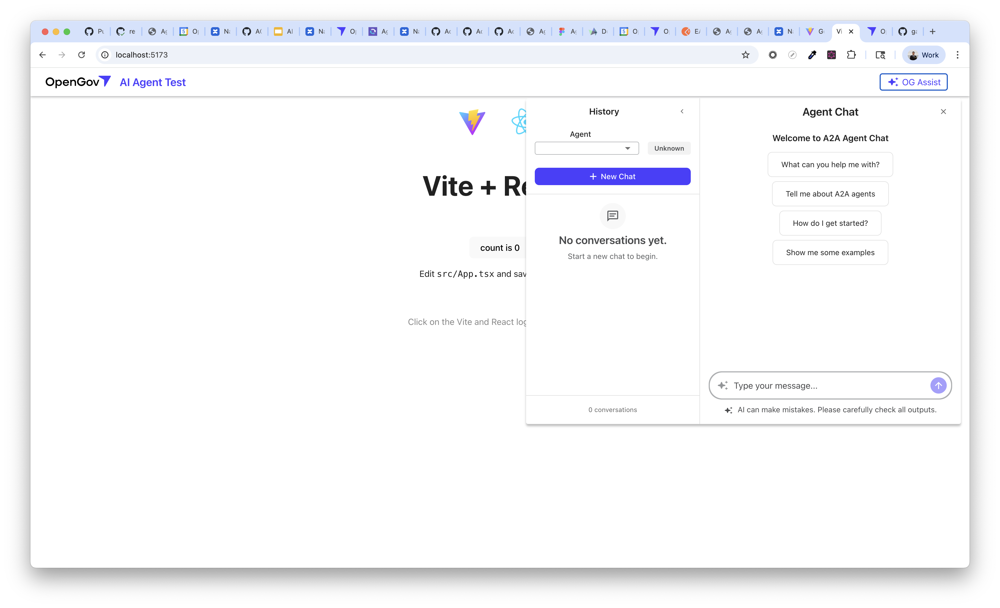

# ai-agent-test

Starter kit to show an example of how to add the agent sdk into your react application with the navbar

## Overview

This project demonstrates how to integrate the Claude Agent SDK into a React application, providing a practical example of building AI-powered features with a clean navigation interface. The starter kit serves as a foundation for developers looking to incorporate Claude's conversational AI capabilities into their web applications.

## Features

- Pre-configured React application with Agent SDK integration
- Navigation bar component for seamless UI/UX
- Example implementation showing best practices for agent integration
- Ready-to-use starter template for rapid development

## Getting Started

### Prerequisites

- Node.js (v14 or higher)
- npm or yarn package manager
- NPM_AUTH_TOKEN for package access

### Installation

1. Clone the repository
2. Install dependencies:
   ```bash
   npm install
   ```
3. Configure your environment variables
4. Run the development server:
   ```bash
   npm start
   ```

## Project Structure

This starter kit includes essential components and configurations to get you up and running with the Agent SDK quickly. The navbar integration demonstrates how to create a cohesive user experience when working with AI agents.

## Usage

The application provides a working example of how to structure your React components when integrating the Agent SDK. Review the implementation to understand the patterns and adapt them to your specific use case.

